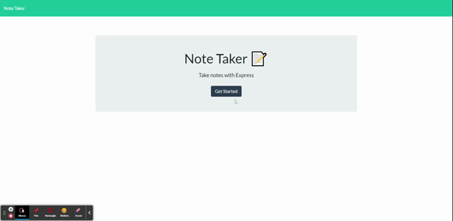

  # Note Taker

  

  ## Description
  
  This express application uses a local API to create and save notes alongside a group of router functions to save, edit, and recall user inputs.

  ## Table of Contents
  
  * [Installation](#installation)
  * [Usage](#usage)
  * [License](#license)
  * [Contributing](#contributing)
  * [Tests](#tests)
  * [Questions](#questions)
  
  ## Installation
  
  This application uses `node` and requires an install line with the following information `npm i express path uuid`. Make sure the server is running before local use with `npm start`.

  ## Usage

  
  
  The main usage of this product is that to save and retrieve simple JSON data. Each note is stored using an express `post` and is attached with a unique uuid. When the `delete` is called, the note with the attached unique uuid is spliced out of the JSON data. All links within the application are accessed through express routes.

  ## Contributing
  
  No contributors at this time

  ## Tests
  
  No tests for this project

  ## Questions
  
  Reach out to me at the links below with any questions, comments, or concerns:

  Live Heroku App: [heroku](https://guarded-shore-32271.herokuapp.com/) 
  GitHub: [adamlsn](https://github.com/adamlsn) 
  email: [adamlsn@gmail.com](mailto:adamlsn@gmail.com)
  